# Spring Boot中开启Spring Security

Spring Security是一款基于Spring的安全框架，主要包含认证和授权两大安全模块，和另外一款流行的安全框架Apache Shiro相比，它拥有更为强大的功能。Spring Security也可以轻松的自定义扩展以满足各种需求，并且对常见的Web安全攻击提供了防护支持。如果你的Web框架选择的是Spring，那么在安全方面Spring Security会是一个不错的选择。

## 开启Spring Security

创建一个Spring Boot项目，然后引入spring-boot-starter-security：

```java
<dependency>
    <groupId>org.springframework.boot</groupId>
    <artifactId>spring-boot-starter-security</artifactId>
</dependency>
```

### 接下来我们创建一个TestController，对外提供一个`/hello`服务：

```java
@RestController
public class TestController {
    @GetMapping("hello")
    public String hello() {
        return "hello spring security";
    }
}
```

这时候我们直接启动项目，访问<http://localhost:8080/hello>，可看到页面弹出了个HTTP Basic认证框：

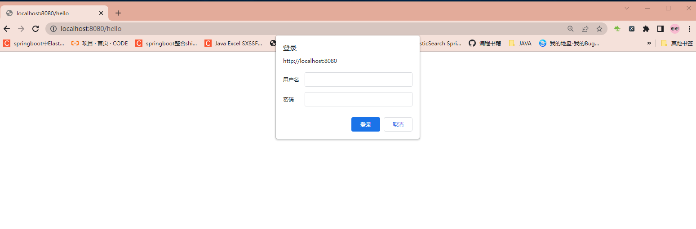

当Spring项目中引入了Spring Security依赖的时候，项目会默认开启如下配置：默认是不需要填写的

```yml
security:
  basic:
    enabled: true
```

这个配置开启了一个HTTP basic类型的认证，所有服务的访问都必须先过这个认证，默认的用户名为user，密码由Sping Security自动生成，回到IDE的控制台，可以找到密码信息：

```java
Using generated security password: 16db035f-ee9a-4d32-988e-912d470e4269
```

输入用户名user，密码16db035f-ee9a-4d32-988e-912d470e4269后，我们便可以成功访问`/hello`接口。

## 基于表单认证

我们可以通过一些配置将HTTP Basic认证修改为基于表单的认证方式。

创建一个配置类`BrowserSecurityConfig`继承`org.springframework.security.config.annotation.web.configuration.WebSecurityConfigurerAdapter`这个抽象类并重写`configure(HttpSecurity http)`方法。`WebSecurityConfigurerAdapter`是由Spring Security提供的Web应用安全配置的适配器：

```java
package com.study.sso.springsecurity.config;

import org.springframework.context.annotation.Configuration;
import org.springframework.security.config.annotation.web.builders.HttpSecurity;
import org.springframework.security.config.annotation.web.configuration.WebSecurityConfigurerAdapter;

@Configuration
public class BrowserSecurityConfig extends WebSecurityConfigurerAdapter {

    @Override
    protected void configure(HttpSecurity http) throws Exception {
        http.formLogin() // 表单登录
                // http.httpBasic() // HTTP Basic
                .and()
                .authorizeRequests() // 授权配置
                .anyRequest()  // 所有请求
                .authenticated(); // 都需要认证
    }
}
```

上面配置指定了认证方式为表单登录，并且所有请求都需要进行认证。这时候我们重启项目，再次访问<http://localhost:8080/hello>，可以看到认证方式已经是form表单的方式了：

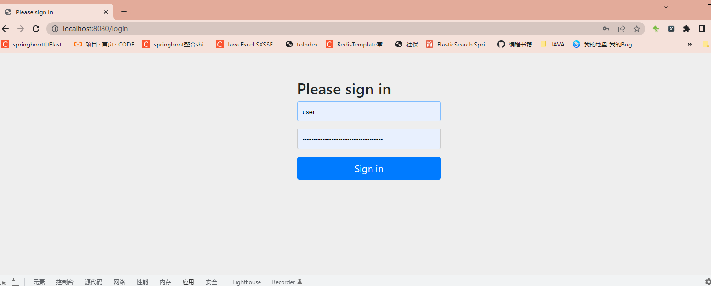

用户名依旧是user，密码由Spring Security自动生成。当输入凭证错误时，页面上将显示用户名或密码错误。

Spring Security包含了众多的过滤器，这些过滤器形成了一条链，所有请求都必须通过这些过滤器后才能成功访问到资源。

Spring Security包含了众多的过滤器，这些过滤器形成了一条链，所有请求都必须通过这些过滤器后才能成功访问到资源。其中`UsernamePasswordAuthenticationFilter`过滤器用于处理基于**表单**方式的登录认证，而`BasicAuthenticationFilter`用于处理基于HTTP Basic方式的**登录**验证，后面还可能包含一系列别的过滤器（可以通过相应配置开启）。在过滤器链的末尾是一个名为`FilterSecurityInterceptor`的拦截器，用于判断当前请求身份认证是否成功，是否有相应的权限，当身份认证失败或者权限不足的时候便会抛出相应的异常。`ExceptionTranslateFilter`捕获并处理，所以我们在`ExceptionTranslateFilter`过滤器用于处理了`FilterSecurityInterceptor`抛出的异常并进行处理，比如需要身份认证时将请求重定向到相应的认证页面，当认证失败或者权限不足时返回相应的提示信息。

下面我们通过debug来验证这个过程（登录方式改回表单的方式）。

我们在`/hello`服务上打个断点：

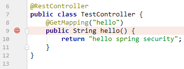

在`FilterSecurityInterceptor`的invoke方法的`super.beforeInvocation`上打个断点：

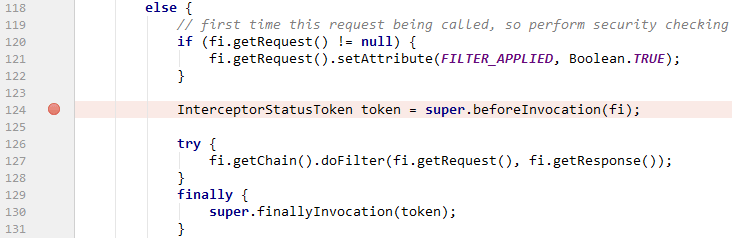

当这行代码执行通过后，便可以调用下一行的`doFilter`方法来真正调用`/hello`服务，否则将抛出相应的异常。

当`FilterSecurityInterceptor`抛出异常时，异常将由`ExceptionTranslateFilter`捕获并处理，所以我们在`ExceptionTranslateFilter`的`doFilter`方法`catch`代码块第一行打个断点：

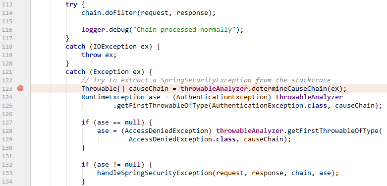

我们待会模拟的是用户未登录直接访问`/hello`，所以应该是抛出用户未认证的异常，所以接下来应该跳转到`UsernamePasswordAuthenticationFilter`处理表单方式的用户认证。在`UsernamePasswordAuthenticationFilter`的`attemptAuthentication`方法上打个断点：

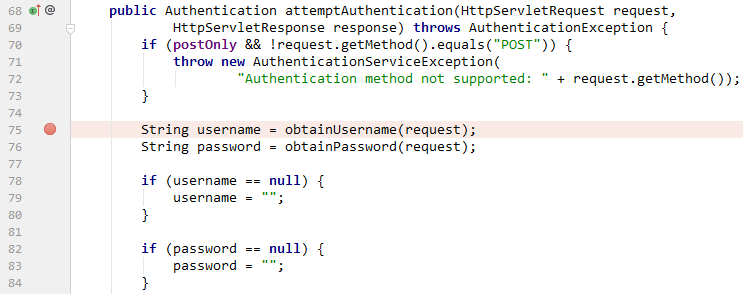

准备完毕后，我们启动项目，然后访问<http://localhost:8080/hello>，代码直接跳转到`FilterSecurityInteceptor`的断点上：

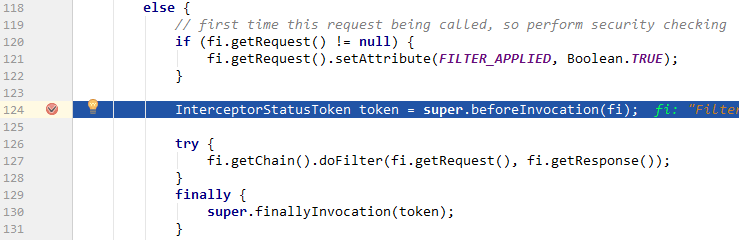

往下执行，因为当前请求没有经过身份认证，所以将抛出异常并被`ExceptionTranslateFilter`捕获：

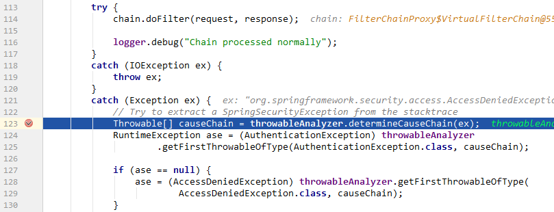

捕获异常后重定向到登录表单登录页面，当我们在表单登录页面输入信息点login后，代码跳转到`UsernamePasswordAuthenticationFilter`过滤器的`attemptAuthentication`方法上：

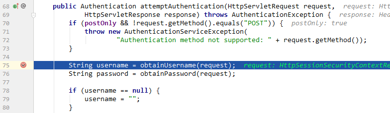

判断用户名和密码是否正确之后，代码又跳回`FilterSecurityInterceptor`的`beforeInvocation`方法执行上：

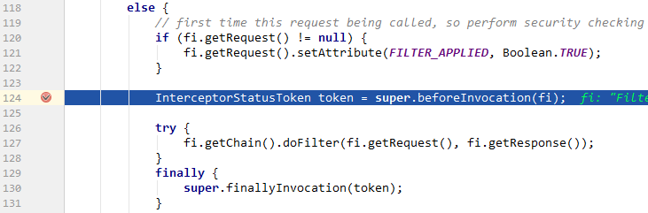


当认证通过时，`FilterSecurityInterceptor`代码往下执行`doFilter`，然后代码最终跳转到`/hello`上：

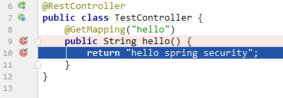

浏览器页面将显示`hello spring security`信息。


# Spring Security自定义用户登陆

我们简单搭建了个Spring Boot + Spring Security的项目，认证的用户名和密码都是由Spring Security生成。Spring Security支持我们自定义认证的过程，如处理用户信息获取逻辑，使用我们自定义的登录页面替换Spring Security默认的登录页及自定义登录成功或失败后的处理逻辑等。继续进行改造

## 自定义认证过程

自定义认证的过程需要实现Spring Security提供的`UserDetailService`接口，该接口只有一个抽象方法`loadUserByUsername`，源码如下：

```java
public interface UserDetailsService {
    UserDetails loadUserByUsername(String username) throws UsernameNotFoundException;
}
```

`loadUserByUsername`方法返回一个`UserDetail`对象，该对象也是一个接口，包含一些用于描述用户信息的方法，源码如下：

```java
public interface UserDetails extends Serializable {

    //获取用户包含的权限，返回权限集合，权限是一个继承了GrantedAuthority的对象；
    Collection<? extends GrantedAuthority> getAuthorities();
    //用于获取密码
    String getPassword();
	//用于获取用户名
    String getUsername();
	//用于判断账户是否未过期，未过期返回true反之返回false；
    boolean isAccountNonExpired();
	//方法用于判断账户是否未锁定；
    boolean isAccountNonLocked();
	//用于判断用户凭证是否没过期，即密码是否未过期
    boolean isCredentialsNonExpired();
	//方法用于判断用户是否可用
    boolean isEnabled();
}
```

实际中我们可以自定义`UserDetails`接口的实现类，也可以直接使用Spring Security提供的`UserDetails`接口实现类`org.springframework.security.core.userdetails.User`。

说了那么多，下面我们来开始实现`UserDetailService`接口的`loadUserByUsername`方法。

首先创建一个`MyUser`对象，用于存放模拟的用户数据（实际中一般从数据库获取，这里为了方便直接模拟）：

```java
package com.study.sso.springsecurity.entity;

import lombok.Data;

import java.io.Serializable;

@Data
public class MyUser implements Serializable {
    private static final long serialVersionUID = 3497935890426858541L;
    //用于获取用户名
    private String userName;
    //用于获取密码
    private String password;
    //用于判断账户是否未过期，未过期返回true反之返回false；
    private boolean accountNonExpired = true;
    //方法用于判断账户是否未锁定；
    private boolean accountNonLocked= true;
    //用于判断用户凭证是否没过期，即密码是否未过期
    private boolean credentialsNonExpired= true;
    //方法用于判断用户是否可用
    private boolean enabled= true;
}
```

接着创建`MyUserDetailService`实现`UserDetailService`：

```java
package com.study.sso.springsecurity.service;

import com.study.sso.springsecurity.entity.MyUser;
import org.springframework.beans.factory.annotation.Autowired;
import org.springframework.context.annotation.Configuration;
import org.springframework.security.core.authority.AuthorityUtils;
import org.springframework.security.core.userdetails.User;
import org.springframework.security.core.userdetails.UserDetails;
import org.springframework.security.core.userdetails.UserDetailsService;
import org.springframework.security.core.userdetails.UsernameNotFoundException;
import org.springframework.security.crypto.bcrypt.BCryptPasswordEncoder;
import org.springframework.security.crypto.password.PasswordEncoder;

@Configuration
public class UserDetailService implements UserDetailsService {
    @Autowired
    private PasswordEncoder passwordEncoder;

    @Override
    public UserDetails loadUserByUsername(String username) throws UsernameNotFoundException {
        // 模拟一个用户，替代数据库获取逻辑
        MyUser user = new MyUser();
        user.setUserName(username);
        //Spring MD5的处理
//        BCryptPasswordEncoder passwordEncoder = new BCryptPasswordEncoder();
//        String encodedPassword1 = passwordEncoder.encode("123456");

        user.setPassword(this.passwordEncoder.encode("123456"));
        // 输出加密后的密码
        System.out.println(user.getPassword());

        return new User(username, user.getPassword(), user.isEnabled(),
                user.isAccountNonExpired(), user.isCredentialsNonExpired(),
                user.isAccountNonLocked(), AuthorityUtils.commaSeparatedStringToAuthorityList("admin"));
    }
}
```

里我们使用了`org.springframework.security.core.userdetails.User`类包含7个参数的构造器，其还包含一个三个参数的构造器`User(String username, String password,Collection<? extends GrantedAuthority> authorities)`，由于权限参数不能为空，所以这里先使用`AuthorityUtils.commaSeparatedStringToAuthorityList`方法模拟一个admin的权限，该方法可以将逗号分隔的字符串转换为权限集合。

此外我们还注入了`PasswordEncoder`对象，该对象用于密码加密，注入前需要手动配置。我们在`BrowserSecurityConfig`中配置它：

```java
package com.study.sso.springsecurity.config;

import org.springframework.context.annotation.Bean;
import org.springframework.context.annotation.Configuration;
import org.springframework.security.config.annotation.web.builders.HttpSecurity;
import org.springframework.security.config.annotation.web.configuration.WebSecurityConfigurerAdapter;
import org.springframework.security.crypto.bcrypt.BCryptPasswordEncoder;
import org.springframework.security.crypto.password.PasswordEncoder;

@Configuration
public class BrowserSecurityConfig extends WebSecurityConfigurerAdapter {

    @Override
    protected void configure(HttpSecurity http) throws Exception {
        http.formLogin() // 表单登录
                // http.httpBasic() // HTTP Basic
                .and()
                .authorizeRequests() // 授权配置
                .anyRequest()  // 所有请求
                .authenticated(); // 都需要认证
    }

    @Bean
    public PasswordEncoder passwordEncoder() {
        return new BCryptPasswordEncoder();
    }
}
```

`PasswordEncoder`是一个密码加密接口，而`BCryptPasswordEncoder`是Spring Security提供的一个实现方法，我们也可以自己实现`PasswordEncoder`。不过Spring Security实现的`BCryptPasswordEncoder`已经足够强大，它对相同的密码进行加密后可以生成不同的结果。

这时候重启项目，访问<http://localhost:8080/login>，便可以使用任意用户名以及123456作为密码登录系统。我们多次进行登录操作，可以看到控制台输出的加密后的密码如下，且每次同样的字符串加密后的字符串都不一样：

```
$2a$10$xJ7V5xesEGtyuHmmp.Iigu1oUr9RxqVrpIRl2cSPlTL3bCZlCDcZK
```

## 替换默认登录页

默认的登录页面过于简陋，我们可以自己定义一个登录页面。为了方便起见，我们直接在src/main/resources/resources目录下定义一个login.html（不需要Controller跳转）：

```html
<!DOCTYPE html>
<html>
<head>
    <meta charset="UTF-8">
    <title>登录</title>
    <link rel="stylesheet" href="css/login.css" type="text/css">
</head>
<body>
<form class="login-page" action="/login" method="post">
    <div class="form">
        <h3>账户登录</h3>
        <input type="text" placeholder="用户名" name="username" required="required" />
        <input type="password" placeholder="密码" name="password" required="required" />
        <button type="submit">登录</button>
    </div>
</form>
</body>
</html>
```

要怎么做才能让Spring Security跳转到我们自己定义的登录页面呢？很简单，只需要在`BrowserSecurityConfig`的`configure`中添加一些配置：

```java
    http.formLogin() // 表单登录
            // http.httpBasic() // HTTP Basic
            .loginPage("/login.html") 
            .loginProcessingUrl("/login")
            .and()
            .authorizeRequests() // 授权配置
            .antMatchers("/login.html").permitAll()
            .anyRequest()  // 所有请求
            .authenticated(); // 都需要认证
}
```

上面代码中`.loginPage("/login.html")`指定了跳转到登录页面的请求URL，`.loginProcessingUrl("/login")`对应登录页面form表单的`action="/login"`，`.antMatchers("/login.html").permitAll()`表示跳转到登录页面的请求不被拦截，否则会进入无限循环。

这时候启动系统，访问<http://localhost:8080/hello>，会看到页面已经被重定向到了<http://localhost:8080/login.html>：

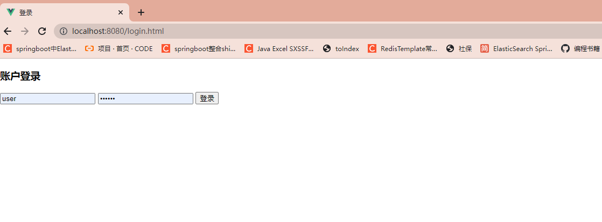

这个时候发现我们引入的CSS没有生效，这时候需要添加一个CSS的的放行

```java
@Override
protected void configure(HttpSecurity http) throws Exception {
    http.formLogin() // 表单登录
            // http.httpBasic() // HTTP Basic
            .loginPage("/login.html") // 登录跳转 URL
            .loginProcessingUrl("/login") //// 处理表单登录 URL
            .and()
            .authorizeRequests() // 授权配置
            .antMatchers("/login.html").permitAll() //表示跳转到登录页面的请求不被拦截，否则会进入无限循环
            .antMatchers("/css/**").permitAll()
            .anyRequest()  // 所有请求
            .authenticated();// 都需要认证
}
```

这个时候在页面点击按钮没有任何效果，相当于重新刷新页面，这个时候需要在 configure当中再添加一句and().csrf().disable(); 

```java
protected void configure(HttpSecurity http) throws Exception {
    http.formLogin() // 表单登录
            // http.httpBasic() // HTTP Basic
            .loginPage("/login.html") // 登录跳转 URL
            .loginProcessingUrl("/login") //// 处理表单登录 URL
            .and()
            .authorizeRequests() // 授权配置
            .antMatchers("/login.html").permitAll() //表示跳转到登录页面的请求不被拦截，否则会进入无限循环
            .antMatchers("/css/**").permitAll()
            .anyRequest()  // 所有请求
            .authenticated().// 都需要认证
             and().csrf().disable(); //CSRF攻击防御关了
}
```

假如现在有这样一个需求：在未登录的情况下，当用户访问html资源的时候跳转到登录页，否则返回JSON格式数据，状态码为401。

要实现这个功能我们将`loginPage`的URL改为`/authentication/require`，并且在`antMatchers`方法中加入该URL，让其免拦截:

```java
@Override
protected void configure(HttpSecurity http) throws Exception {
    http.formLogin() // 表单登录
            // http.httpBasic() // HTTP Basic
            .loginPage("/login.html") // 登录跳转 URL
            .loginProcessingUrl("/login") //// 处理表单登录 URL
            .and()
            .authorizeRequests() // 授权配置
            .antMatchers("/login.html").permitAll() //表示跳转到登录页面的请求不被拦截，否则会进入无限循环
            .antMatchers("/authentication/require").permitAll() // 登录跳转 URL 无需认证
            .antMatchers("/css/**").permitAll()
            .anyRequest()  // 所有请求
            .authenticated().// 都需要认证
             and().csrf().disable(); //CSRF攻击防御关了
}
```

然后定义一个控制器`BrowserSecurityController`，处理这个请求：

```java
@RestController
public class BrowserSecurityController {
    private RequestCache requestCache = new HttpSessionRequestCache();
    private RedirectStrategy redirectStrategy = new DefaultRedirectStrategy();

    @GetMapping("/authentication/require")
    @ResponseStatus(HttpStatus.UNAUTHORIZED)
    public String requireAuthentication(HttpServletRequest request, HttpServletResponse response) throws IOException {
        SavedRequest savedRequest = requestCache.getRequest(request, response);
        if (savedRequest != null) {
            String targetUrl = savedRequest.getRedirectUrl();
            if (StringUtils.endsWithIgnoreCase(targetUrl, ".html"))
                redirectStrategy.sendRedirect(request, response, "/login.html");
        }
        return "访问的资源需要身份认证！";
    }
}
```

其中`HttpSessionRequestCache`为Spring Security提供的用于缓存请求的对象，通过调用它的`getRequest`方法可以获取到本次请求的HTTP信息。`DefaultRedirectStrategy`的`sendRedirect`为Spring Security提供的用于处理重定向的方法。

上面代码获取了引发跳转的请求，根据请求是否以`.html`为结尾来对应不同的处理方法。如果是以`.html`结尾，那么重定向到登录页面，否则返回”访问的资源需要身份认证！”信息，并且HTTP状态码为401（`HttpStatus.UNAUTHORIZED`）。

这样当我们访问<http://localhost:8080/hello>的时候页面便会跳转到<http://localhost:8080/authentication/require>，并且输出”访问的资源需要身份认证！”，当我们访问<http://localhost:8080/hello.html>的时候，页面将会跳转到登录页面。

## 处理成功和失败

Spring Security有一套默认的处理登录成功和失败的方法：当用户登录成功时，页面会跳转会引发登录的请求，比如在未登录的情况下访问<http://localhost:8080/hello>，页面会跳转到登录页，登录成功后再跳转回来；登录失败时则是跳转到Spring Security默认的错误提示页面。下面我们通过一些自定义配置来替换这套默认的处理机制。

### 自定义登录成功逻辑

要改变默认的处理成功逻辑很简单，只需要实现`org.springframework.security.web.authentication.AuthenticationSuccessHandler`接口的`onAuthenticationSuccess`方法即可：

```java
package com.study.sso.springsecurity.config;

import com.fasterxml.jackson.databind.ObjectMapper;
import org.springframework.beans.factory.annotation.Autowired;
import org.springframework.security.core.Authentication;
import org.springframework.security.web.authentication.AuthenticationSuccessHandler;
import org.springframework.stereotype.Component;

import javax.servlet.ServletException;
import javax.servlet.http.HttpServletRequest;
import javax.servlet.http.HttpServletResponse;
import java.io.IOException;

@Component
public class MyAuthenticationSucessHandler implements AuthenticationSuccessHandler {

    @Autowired
    private ObjectMapper mapper;

    @Override
    public void onAuthenticationSuccess(HttpServletRequest request, HttpServletResponse response,
                                        Authentication authentication) throws IOException, ServletException {
        response.setContentType("application/json;charset=utf-8");
        response.getWriter().write(mapper.writeValueAsString(authentication));
    }
}

```

其中`Authentication`参数既包含了认证请求的一些信息，比如IP，请求的SessionId等，也包含了用户信息，即前面提到的`User`对象。通过上面这个配置，用户登录成功后页面将打印出`Authentication`对象的信息。

要使这个配置生效，我们还的在`BrowserSecurityConfig`的`configure`中配置它：

```java
package com.study.sso.springsecurity.config;

import org.springframework.beans.factory.annotation.Autowired;
import org.springframework.context.annotation.Bean;
import org.springframework.context.annotation.Configuration;
import org.springframework.security.config.annotation.web.builders.HttpSecurity;
import org.springframework.security.config.annotation.web.configuration.WebSecurityConfigurerAdapter;
import org.springframework.security.crypto.bcrypt.BCryptPasswordEncoder;
import org.springframework.security.crypto.password.PasswordEncoder;

@Configuration
public class BrowserSecurityConfig extends WebSecurityConfigurerAdapter {

    @Autowired
    private MyAuthenticationSucessHandler authenticationSucessHandler;

    @Override
    protected void configure(HttpSecurity http) throws Exception {
        http.formLogin() // 表单登录
                // http.httpBasic() // HTTP Basic
                .loginPage("/login.html") // 登录跳转 URL
                .loginProcessingUrl("/login") //// 处理表单登录 URL
                .successHandler(authenticationSucessHandler) // 处理登录成功
                .and()
                .authorizeRequests() // 授权配置
                .antMatchers("/login.html").permitAll() //表示跳转到登录页面的请求不被拦截，否则会进入无限循环
                .antMatchers("/authentication/require").permitAll() // 登录跳转 URL 无需认证
                .antMatchers("/css/**").permitAll()
                .anyRequest()  // 所有请求
                .authenticated().// 都需要认证
                 and().csrf().disable(); //CSRF攻击防御关了
    }

    //
    @Bean
    public PasswordEncoder passwordEncoder() {
        return new BCryptPasswordEncoder();
    }
}
```

我们将`MyAuthenticationSucessHandler`注入进来，并通过`successHandler`方法进行配置。

这时候重启项目登录后页面将会输出如下JSON信息：

```json
{
	"authorities": [{
		"authority": "admin"
	}],
	"details": {
		"remoteAddress": "0:0:0:0:0:0:0:1",
		"sessionId": "9932543CB27193C491BFA18CAE0817D6"
	},
	"authenticated": true,
	"principal": {
		"password": null,
		"username": "user",
		"authorities": [{
			"authority": "admin"
		}],
		"accountNonExpired": true,
		"accountNonLocked": true,
		"credentialsNonExpired": true,
		"enabled": true
	},
	"credentials": null,
	"name": "user"
}


```

像`password`，`credentials`这些敏感信息，Spring Security已经将其屏蔽。

除此之外，我们也可以在登录成功后做页面的跳转，修改`MyAuthenticationSucessHandler`：

```java
package com.study.sso.springsecurity.config;

import com.fasterxml.jackson.databind.ObjectMapper;
import org.springframework.beans.factory.annotation.Autowired;
import org.springframework.security.core.Authentication;
import org.springframework.security.web.DefaultRedirectStrategy;
import org.springframework.security.web.RedirectStrategy;
import org.springframework.security.web.authentication.AuthenticationSuccessHandler;
import org.springframework.security.web.savedrequest.HttpSessionRequestCache;
import org.springframework.security.web.savedrequest.RequestCache;
import org.springframework.security.web.savedrequest.SavedRequest;
import org.springframework.stereotype.Component;

import javax.servlet.ServletException;
import javax.servlet.http.HttpServletRequest;
import javax.servlet.http.HttpServletResponse;
import java.io.IOException;

@Component
public class MyAuthenticationSucessHandler implements AuthenticationSuccessHandler {
    //其中`HttpSessionRequestCache`为Spring Security提供的用于缓存请求的对象，通过调用它的`getRequest`方法可以获取到本次请求的HTTP信息。
    private RequestCache requestCache = new HttpSessionRequestCache();
    //DefaultRedirectStrategy`的`sendRedirect`为Spring Security提供的用于处理重定向的方法。
    private RedirectStrategy redirectStrategy = new DefaultRedirectStrategy();

    @Autowired
    private ObjectMapper mapper;

    @Override
    public void onAuthenticationSuccess(HttpServletRequest request, HttpServletResponse response,
                                        Authentication authentication) throws IOException {
        SavedRequest savedRequest = requestCache.getRequest(request, response);
        redirectStrategy.sendRedirect(request, response, savedRequest.getRedirectUrl());
    }
}
```

通过上面配置，登录成功后页面将跳转回引发跳转的页面。如果想指定跳转的页面，比如跳转到`/index`，可以将`savedRequest.getRedirectUrl()`修改为`/index`：

```java
package com.study.sso.springsecurity.config;

import com.fasterxml.jackson.databind.ObjectMapper;
import org.springframework.beans.factory.annotation.Autowired;
import org.springframework.security.core.Authentication;
import org.springframework.security.web.DefaultRedirectStrategy;
import org.springframework.security.web.RedirectStrategy;
import org.springframework.security.web.authentication.AuthenticationSuccessHandler;
import org.springframework.security.web.savedrequest.HttpSessionRequestCache;
import org.springframework.security.web.savedrequest.RequestCache;
import org.springframework.security.web.savedrequest.SavedRequest;
import org.springframework.stereotype.Component;

import javax.servlet.ServletException;
import javax.servlet.http.HttpServletRequest;
import javax.servlet.http.HttpServletResponse;
import java.io.IOException;

@Component
public class MyAuthenticationSucessHandler implements AuthenticationSuccessHandler {
    //其中`HttpSessionRequestCache`为Spring Security提供的用于缓存请求的对象，通过调用它的`getRequest`方法可以获取到本次请求的HTTP信息。
    private RequestCache requestCache = new HttpSessionRequestCache();
    //DefaultRedirectStrategy`的`sendRedirect`为Spring Security提供的用于处理重定向的方法。
    private RedirectStrategy redirectStrategy = new DefaultRedirectStrategy();

    @Autowired
    private ObjectMapper mapper;

    @Override
    public void onAuthenticationSuccess(HttpServletRequest request, HttpServletResponse response,
                                        Authentication authentication) throws IOException {
        //SavedRequest savedRequest = requestCache.getRequest(request, response);
        //redirectStrategy.sendRedirect(request, response, savedRequest.getRedirectUrl());  //哪里来的跳转到哪
        redirectStrategy.sendRedirect(request, response, "/index");  //跳转指定位置
    }
}
```

然后在TestController中定义一个处理该请求的方法：

```java
 @GetMapping("index")
    public Object index(){
        return SecurityContextHolder.getContext().getAuthentication();
    }
```

登录成功后，便可以使用`SecurityContextHolder.getContext().getAuthentication()`获取到`Authentication`对象信息。除了通过这种方式获取`Authentication`对象信息外，也可以使用下面这种方式:

```java
@GetMapping("index")
public Object index(Authentication authentication) {
    return authentication;
}
```

重启项目，登录成功后，页面将跳转到<http://localhost:8080/index>：

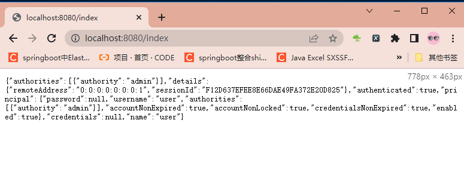

### 自定义登录失败逻辑

和自定义登录成功处理逻辑类似，自定义登录失败处理逻辑需要实现`org.springframework.security.web.authentication.AuthenticationFailureHandler`的`onAuthenticationFailure`方法：

```java
@Component
public class MyAuthenticationFailureHandler implements AuthenticationFailureHandler {
    @Override
    public void onAuthenticationFailure(HttpServletRequest request, HttpServletResponse response,
                                        AuthenticationException exception) throws IOException {
    }
}
```

`onAuthenticationFailure`方法的`AuthenticationException`参数是一个抽象类，Spring Security根据登录失败的原因封装了许多对应的实现类，

查看`AuthenticationException`的Hierarchy：

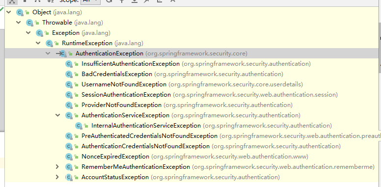

不同的失败原因对应不同的异常，比如用户名或密码错误对应的是`BadCredentialsException`，用户不存在对应的是`UsernameNotFoundException`，用户被锁定对应的是`LockedException`等。

假如我们需要在登录失败的时候返回失败信息，可以这样处理：

```java
@Component
public class MyAuthenticationFailureHandler implements AuthenticationFailureHandler {

    @Autowired
    private ObjectMapper mapper;

    @Override
    public void onAuthenticationFailure(HttpServletRequest request, HttpServletResponse response,
                                        AuthenticationException exception) throws IOException {
        response.setStatus(HttpStatus.INTERNAL_SERVER_ERROR.value());
        response.setContentType("application/json;charset=utf-8");
        response.getWriter().write(mapper.writeValueAsString(exception.getMessage()));
    }
}
```

状态码定义为500（`HttpStatus.INTERNAL_SERVER_ERROR.value()`），即系统内部异常。

同样的，我们需要在`BrowserSecurityConfig`的`configure`中配置它：

```
package com.study.sso.springsecurity.config;

import com.study.sso.springsecurity.handler.MyAuthenticationFailureHandler;
import com.study.sso.springsecurity.handler.MyAuthenticationSucessHandler;
import org.springframework.beans.factory.annotation.Autowired;
import org.springframework.context.annotation.Bean;
import org.springframework.context.annotation.Configuration;
import org.springframework.security.config.annotation.web.builders.HttpSecurity;
import org.springframework.security.config.annotation.web.configuration.WebSecurityConfigurerAdapter;
import org.springframework.security.crypto.bcrypt.BCryptPasswordEncoder;
import org.springframework.security.crypto.password.PasswordEncoder;

@Configuration
public class BrowserSecurityConfig extends WebSecurityConfigurerAdapter {

    @Autowired
    private MyAuthenticationSucessHandler authenticationSucessHandler;

    @Autowired
    private MyAuthenticationFailureHandler authenticationFailureHandler;

    @Override
    protected void configure(HttpSecurity http) throws Exception {
        http.formLogin() // 表单登录
                // http.httpBasic() // HTTP Basic
                .loginPage("/login.html") // 登录跳转 URL
                .loginProcessingUrl("/login") //// 处理表单登录 URL
                .successHandler(authenticationSucessHandler) // 处理登录成功
                .failureHandler(authenticationFailureHandler) // 处理登录失败
                .and()
                .authorizeRequests() // 授权配置
                .antMatchers("/login.html").permitAll() //表示跳转到登录页面的请求不被拦截，否则会进入无限循环
                .antMatchers("/authentication/require").permitAll() // 登录跳转 URL 无需认证
                .antMatchers("/css/**").permitAll()
                .anyRequest()  // 所有请求
                .authenticated().// 都需要认证
                 and().csrf().disable(); //CSRF攻击防御关了
    }

    //
    @Bean
    public PasswordEncoder passwordEncoder() {
        return new BCryptPasswordEncoder();
    }
}
```

重启项目，当输入错误的密码时，页面输出如下：

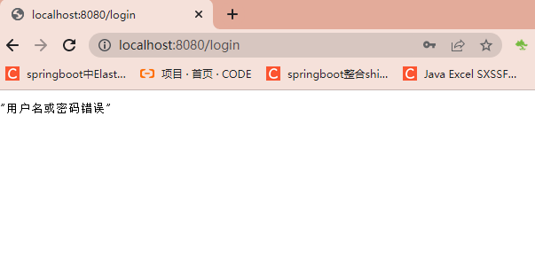

# Spring Security添加图形验证码

添加验证码大致可以分为三个步骤：根据随机数生成验证码图片；将验证码图片显示到登录页面；认证流程中加入验证码校验。Spring Security的认证校验是由`UsernamePasswordAuthenticationFilter`过滤器完成的,所以我们的验证码校验逻辑应该在这个过滤器之前

## 生成图形验证码  

验证码功能需要用到`spring-social-config`依赖：

```java
<dependency>
    <groupId>org.springframework.social</groupId>
    <artifactId>spring-social-config</artifactId>
</dependency>
```

首先定义一个验证码对象ImageCode：

```java
package com.study.sso.springsecurity.entity;

import lombok.Data;

import java.awt.image.BufferedImage;
import java.time.LocalDateTime;

@Data
public class ImageCode {

    private BufferedImage image;

    private String code;

    private LocalDateTime expireTime;

    public ImageCode(BufferedImage image, String code, int expireIn) {
        this.image = image;
        this.code = code;
        this.expireTime = LocalDateTime.now().plusSeconds(expireIn);
    }

    public ImageCode(BufferedImage image, String code, LocalDateTime expireTime) {
        this.image = image;
        this.code = code;
        this.expireTime = expireTime;
    }

    public boolean isExpire() {
        return LocalDateTime.now().isAfter(expireTime);
    }
}
```

ImageCode对象包含了三个属性：`image`图片，`code`验证码和`expireTime`过期时间。`isExpire`方法用于判断验证码是否已过期。

接着定义一个ValidateCodeController，用于处理生成验证码请求：

```java
@RestController
public class ValidateController {

    private SessionStrategy sessionStrategy = new HttpSessionSessionStrategy();

    @GetMapping("/code/image")
    public void createCode(HttpServletRequest request, HttpServletResponse response) throws IOException {
        ImageCode imageCode = createImageCode();
        sessionStrategy.setAttribute(new ServletWebRequest(request), SESSION_KEY_IMAGE_CODE, imageCode);
        ImageIO.write(imageCode.getImage(), "jpeg", response.getOutputStream());
    }
}
```


`createImageCode`方法用于生成验证码对象，`org.springframework.social.connect.web.HttpSessionSessionStrategy`对象封装了一些处理Session的方法，包含了`setAttribute`、`getAttribute`和`removeAttribute`方法，具体可以查看该类的源码。使用`sessionStrategy`将生成的验证码对象存储到Session中，并通过IO流将生成的图片输出到登录页面上。

其中`createImageCode`方法代码如下所示：

```java
private ImageCode createImageCode() {

    int width = 100; // 验证码图片宽度
    int height = 36; // 验证码图片长度
    int length = 4; // 验证码位数
    int expireIn = 60; // 验证码有效时间 60s

    BufferedImage image = new BufferedImage(width, height, BufferedImage.TYPE_INT_RGB);
    Graphics g = image.getGraphics();

    Random random = new Random();

    g.setColor(getRandColor(200, 250));
    g.fillRect(0, 0, width, height);
    g.setFont(new Font("Times New Roman", Font.ITALIC, 20));
    g.setColor(getRandColor(160, 200));
    for (int i = 0; i < 155; i++) {
        int x = random.nextInt(width);
        int y = random.nextInt(height);
        int xl = random.nextInt(12);
        int yl = random.nextInt(12);
        g.drawLine(x, y, x + xl, y + yl);
    }

    StringBuilder sRand = new StringBuilder();
    for (int i = 0; i < length; i++) {
        String rand = String.valueOf(random.nextInt(10));
        sRand.append(rand);
        g.setColor(new Color(20 + random.nextInt(110), 20 + random.nextInt(110), 20 + random.nextInt(110)));
        g.drawString(rand, 13 * i + 6, 16);
    }
    g.dispose();
    return new ImageCode(image, sRand.toString(), expireIn);
}

private Color getRandColor(int fc, int bc) {
    Random random = new Random();
    if (fc > 255) {
        fc = 255;
    }
    if (bc > 255) {
        bc = 255;
    }
    int r = fc + random.nextInt(bc - fc);
    int g = fc + random.nextInt(bc - fc);
    int b = fc + random.nextInt(bc - fc);
    return new Color(r, g, b);
}
```

生成验证码的方法写好后，接下来开始改造登录页面。

## 改造登录页

在登录页面加上如下代码：

```html
<span style="display: inline">
    <input type="text" name="imageCode" placeholder="验证码" style="width: 50%;"/>
    
</span>
```

标签的src属性对应ValidateController的createImageCode方法。

要使生成验证码的请求不被拦截，需要在`BrowserSecurityConfig`的`configure`方法中配置免拦截：

```java
@Override
protected void configure(HttpSecurity http) throws Exception {
    http.formLogin() // 表单登录
            // http.httpBasic() // HTTP Basic
            .loginPage("/login.html") // 登录跳转 URL
            .loginProcessingUrl("/login") //// 处理表单登录 URL
            .successHandler(authenticationSucessHandler) // 处理登录成功
            .failureHandler(authenticationFailureHandler) // 处理登录失败
            .and()
            .authorizeRequests() // 授权配置
            .antMatchers("/login.html").permitAll() //表示跳转到登录页面的请求不被拦截，否则会进入无限循环
            .antMatchers("/authentication/require").permitAll() // 登录跳转 URL 无需认证
            .antMatchers("/css/**","/code/image").permitAll() //无需认证的请求
            .anyRequest()  // 所有请求
            .authenticated().// 都需要认证
             and().csrf().disable(); //CSRF攻击防御关了
}
```

重启项目，访问<http://localhost:8080/login.html>，效果如下：


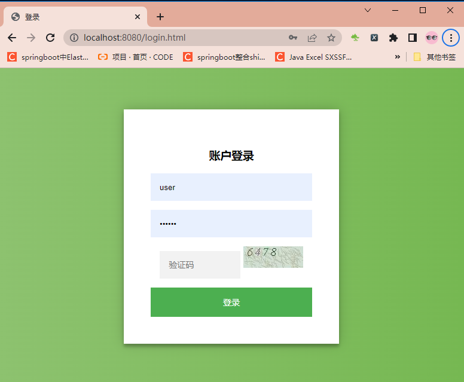

## 认证流程添加验证码校验

在校验验证码的过程中，可能会抛出各种验证码类型的异常，比如“验证码错误”、“验证码已过期”等，所以我们定义一个验证码类型的异常类：

```java
package com.study.sso.springsecurity.exception;

import org.springframework.security.core.AuthenticationException;

public class ValidateCodeException extends AuthenticationException {
    private static final long serialVersionUID = 5022575393500654458L;

   public ValidateCodeException(String message) {
        super(message);
    }
}
```

注意，这里继承的是`AuthenticationException`而不是`Exception`。

我们都知道，Spring Security实际上是由许多过滤器组成的过滤器链，处理用户登录逻辑的过滤器为`UsernamePasswordAuthenticationFilter`，而验证码校验过程应该是在这个过滤器之前的，即只有验证码校验通过后采去校验用户名和密码。由于Spring Security并没有直接提供验证码校验相关的过滤器接口，所以我们需要自己定义一个验证码校验的过滤器`ValidateCodeFilter`：

```java
package com.study.sso.springsecurity.filter;


import com.study.sso.springsecurity.exception.ValidateCodeException;
import org.springframework.beans.factory.annotation.Autowired;
import org.springframework.security.web.authentication.AuthenticationFailureHandler;
import org.springframework.social.connect.web.HttpSessionSessionStrategy;
import org.springframework.social.connect.web.SessionStrategy;
import org.springframework.stereotype.Component;
import org.springframework.web.context.request.ServletWebRequest;
import org.springframework.web.filter.OncePerRequestFilter;

import javax.servlet.FilterChain;
import javax.servlet.ServletException;
import javax.servlet.http.HttpServletRequest;
import javax.servlet.http.HttpServletResponse;
import java.io.IOException;

@Component
public class ValidateCodeFilter extends OncePerRequestFilter {

    @Autowired
    private AuthenticationFailureHandler authenticationFailureHandler;

    private SessionStrategy sessionStrategy = new HttpSessionSessionStrategy();

    @Override
    protected void doFilterInternal(HttpServletRequest httpServletRequest, HttpServletResponse httpServletResponse,
                                    FilterChain filterChain) throws ServletException, IOException {

        if (StringUtils.equalsIgnoreCase("/login", httpServletRequest.getRequestURI())
                && StringUtils.equalsIgnoreCase(httpServletRequest.getMethod(), "post")) {
            try {
                validateCode(new ServletWebRequest(httpServletRequest));
            } catch (ValidateCodeException e) {
                authenticationFailureHandler.onAuthenticationFailure(httpServletRequest, httpServletResponse, e);
                return;
            }
        }
        filterChain.doFilter(httpServletRequest, httpServletResponse);
    }
    private void validateCode(ServletWebRequest servletWebRequest) throws ServletRequestBindingException {
       ...
    }
}
```

`ValidateCodeFilter`继承了`org.springframework.web.filter.OncePerRequestFilter`，该过滤器只会执行一次。

在`doFilterInternal`方法中我们判断了请求URL是否为`/login`，该路径对应登录`form`表单的`action`路径，请求的方法是否为**POST**，是的话进行验证码校验逻辑，否则直接执行`filterChain.doFilter`让代码往下走。当在验证码校验的过程中捕获到异常时，调用Spring Security的校验失败处理器`AuthenticationFailureHandler`进行处理。

`validateCode`的校验逻辑如下所示：

```java
package com.study.sso.springsecurity.filter;


import com.study.sso.springsecurity.controller.ValidateController;
import com.study.sso.springsecurity.entity.ImageCode;
import com.study.sso.springsecurity.exception.ValidateCodeException;
import org.apache.commons.lang3.StringUtils;
import org.springframework.beans.factory.annotation.Autowired;
import org.springframework.security.web.authentication.AuthenticationFailureHandler;
import org.springframework.social.connect.web.HttpSessionSessionStrategy;
import org.springframework.social.connect.web.SessionStrategy;
import org.springframework.stereotype.Component;
import org.springframework.web.bind.ServletRequestBindingException;
import org.springframework.web.bind.ServletRequestUtils;
import org.springframework.web.context.request.ServletWebRequest;
import org.springframework.web.filter.OncePerRequestFilter;

import javax.servlet.FilterChain;
import javax.servlet.ServletException;
import javax.servlet.http.HttpServletRequest;
import javax.servlet.http.HttpServletResponse;
import java.io.IOException;

@Component
public class ValidateCodeFilter extends OncePerRequestFilter {

    @Autowired
    private AuthenticationFailureHandler authenticationFailureHandler;

    private SessionStrategy sessionStrategy = new HttpSessionSessionStrategy();

    @Override
    protected void doFilterInternal(HttpServletRequest httpServletRequest, HttpServletResponse httpServletResponse,
                                    FilterChain filterChain) throws ServletException, IOException {

        if (StringUtils.equalsIgnoreCase("/login", httpServletRequest.getRequestURI())
                && StringUtils.equalsIgnoreCase(httpServletRequest.getMethod(), "post")) {
            try {
                validateCode(new ServletWebRequest(httpServletRequest));
            } catch (ValidateCodeException e) {
                authenticationFailureHandler.onAuthenticationFailure(httpServletRequest, httpServletResponse, e);
                return;
            }
        }
        filterChain.doFilter(httpServletRequest, httpServletResponse);
    }
    private void validateCode(ServletWebRequest servletWebRequest) throws ServletRequestBindingException {
        ImageCode codeInSession = (ImageCode) sessionStrategy.getAttribute(servletWebRequest, ValidateController.SESSION_KEY_IMAGE_CODE);
        String codeInRequest = ServletRequestUtils.getStringParameter(servletWebRequest.getRequest(), "imageCode");

        if (StringUtils.isBlank(codeInRequest)) {
            throw new ValidateCodeException("验证码不能为空！");
        }
        if (codeInSession == null) {
            throw new ValidateCodeException("验证码不存在！");
        }
        if (codeInSession.isExpire()) {
            sessionStrategy.removeAttribute(servletWebRequest, ValidateController.SESSION_KEY_IMAGE_CODE);
            throw new ValidateCodeException("验证码已过期！");
        }
        if (!StringUtils.equalsIgnoreCase(codeInSession.getCode(), codeInRequest)) {
            throw new ValidateCodeException("验证码不正确！");
        }
        sessionStrategy.removeAttribute(servletWebRequest, ValidateController.SESSION_KEY_IMAGE_CODE);

    }
}
```

我们分别从`Session`中获取了`ImageCode`对象和请求参数`imageCode`（对应登录页面的验证码`<input>`框`name`属性）,然后进行了各种判断并抛出相应的异常。当验证码过期或者验证码校验通过时，我们便可以删除`Session`中的`ImageCode`属性了。

验证码校验过滤器定义好了，怎么才能将其添加到`UsernamePasswordAuthenticationFilter`前面呢？很简单，只需要在`BrowserSecurityConfig`的`configure`方法中添加些许配置即可：

```java
package com.study.sso.springsecurity.config;

import com.study.sso.springsecurity.filter.ValidateCodeFilter;
import com.study.sso.springsecurity.handler.MyAuthenticationFailureHandler;
import com.study.sso.springsecurity.handler.MyAuthenticationSucessHandler;
import org.springframework.beans.factory.annotation.Autowired;
import org.springframework.context.annotation.Bean;
import org.springframework.context.annotation.Configuration;
import org.springframework.security.config.annotation.web.builders.HttpSecurity;
import org.springframework.security.config.annotation.web.configuration.WebSecurityConfigurerAdapter;
import org.springframework.security.crypto.bcrypt.BCryptPasswordEncoder;
import org.springframework.security.crypto.password.PasswordEncoder;
import org.springframework.security.web.authentication.UsernamePasswordAuthenticationFilter;

@Configuration
public class BrowserSecurityConfig extends WebSecurityConfigurerAdapter {

    @Autowired
    private MyAuthenticationSucessHandler authenticationSucessHandler;

    @Autowired
    private MyAuthenticationFailureHandler authenticationFailureHandler;

    @Autowired
    private ValidateCodeFilter validateCodeFilter;

    @Override
    protected void configure(HttpSecurity http) throws Exception {
        http.addFilterBefore(validateCodeFilter, UsernamePasswordAuthenticationFilter.class). // 添加验证码校验过滤器
                 formLogin() // 表单登录
                // http.httpBasic() // HTTP Basic
                .loginPage("/login.html") // 登录跳转 URL
                .loginProcessingUrl("/login") //// 处理表单登录 URL
                .successHandler(authenticationSucessHandler) // 处理登录成功
                .failureHandler(authenticationFailureHandler) // 处理登录失败
                .and()
                .authorizeRequests() // 授权配置
                .antMatchers("/login.html").permitAll() //表示跳转到登录页面的请求不被拦截，否则会进入无限循环
                .antMatchers("/authentication/require").permitAll() // 登录跳转 URL 无需认证
                .antMatchers("/css/**","/code/image").permitAll() //无需认证的请求
                .anyRequest()  // 所有请求
                .authenticated().// 都需要认证
                 and().csrf().disable(); //CSRF攻击防御关了
    }

    //
    @Bean
    public PasswordEncoder passwordEncoder() {
        return new BCryptPasswordEncoder();
    }
}
```

上面代码中，我们注入了`ValidateCodeFilter`，然后通过`addFilterBefore`方法将`ValidateCodeFilter`验证码校验过滤器添加到了`UsernamePasswordAuthenticationFilter`前面。

大功告成，重启项目，访问<http://localhost:8080/login.html>，当不输入验证码时点击登录，页面显示如下：

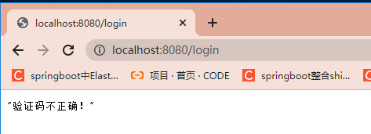

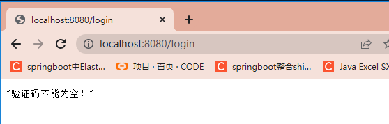

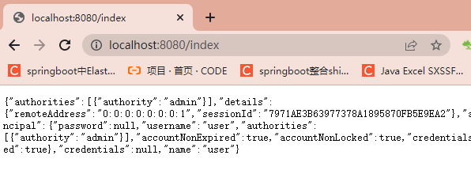

# Spring Security添加记住我功能

在网站的登录页面中，记住我选项是一个很常见的功能，勾选记住我后在一段时间内，用户无需进行登录操作就可以访问系统资源。在Spring Security中添加记住我功能很简单，大致过程是：当用户勾选了记住我选项并登录成功后，Spring Security会生成一个token标识，然后将该token标识持久化到数据库，并且生成一个与该token相对应的cookie返回给浏览器。当用户过段时间再次访问系统时，如果该cookie没有过期，Spring Security便会根据cookie包含的信息从数据库中获取相应的token信息，然后帮用户自动完成登录操作。

##   token持久化

Spring Security的记住我功能的实现需要使用数据库来持久化token。

在application.yml中添加数据源配置：

```yml
server:
  port: 8080
spring:
  application:
    name: springsecruity
  datasource:
    driver-class-name: com.mysql.jdbc.Driver
    url: jdbc:mysql://127.0.0.1:3306/security?useUnicode=yes&characterEncoding=UTF-8&useSSL=false
    username: root
    password: 123456
```

添加数据库依赖：

```java
<dependency>
    <groupId>org.springframework.boot</groupId>
    <artifactId>spring-boot-starter-jdbc</artifactId>
</dependency>
<dependency>
    <groupId>mysql</groupId>
    <artifactId>mysql-connector-java</artifactId>
</dependency>
```

然后我们在`BrowserSecurityConfig`中配置个token持久化对象：

```java
@Configuration
public class BrowserSecurityConfig extends WebSecurityConfigurerAdapter {
    @Autowired
    private UserDetailService userDetailService;
    @Autowired
    private DataSource dataSource;

    @Bean
    public PersistentTokenRepository persistentTokenRepository() {
        JdbcTokenRepositoryImpl jdbcTokenRepository = new JdbcTokenRepositoryImpl();
        jdbcTokenRepository.setDataSource(dataSource);
        jdbcTokenRepository.setCreateTableOnStartup(false);
        return jdbcTokenRepository;
    }
    ...
}
```

`PersistentTokenRepository`为一个接口类，这里我们用的是数据库持久化，所以实例用的是`PersistentTokenRepository`的实现类`JdbcTokenRepositoryImpl`。

`JdbcTokenRepositoryImpl`需要指定数据源，所以我们将配置好的数据源对象`DataSource`注入进来并配置到`JdbcTokenRepositoryImpl`的`dataSource`属性中。`createTableOnStartup`属性用于是否启动项目时创建保存token信息的数据表，这里设置为false，我们自己手动创建。

查看`JdbcTokenRepositoryImpl`的源码，可以看到其包含了一个`CREATE_TABLE_SQL`属性：

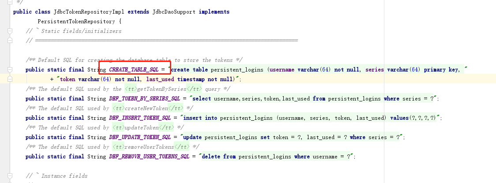

这个其实就是用于保存token对象数据表的SQL语句，我们复制出来手动执行创建表：

```mysql
CREATE TABLE persistent_logins (
    username VARCHAR (64) NOT NULL,
    series VARCHAR (64) PRIMARY KEY,
    token VARCHAR (64) NOT NULL,
    last_used TIMESTAMP NOT NULL
)
```

## 修改登录页

完成上述配置后，我们稍微改造下登录页，加入记住我的勾选选项：

```html
<input type="checkbox" name="remember-me"/> 记住我
```

其中`name`属性必须为`remember-me`。


## 配置生效

最后我们需要在Spring Security的认证流程中启用记住我的功能，在`BrowserSecurityConfig`的`configure`方法中开启记住我功能：

```java
@Override
protected void configure(HttpSecurity http) throws Exception {
    http.addFilterBefore(validateCodeFilter, UsernamePasswordAuthenticationFilter.class) // 添加验证码校验过滤器
            .formLogin() // 表单登录
                // http.httpBasic() // HTTP Basic
                .loginPage("/authentication/require") // 登录跳转 URL
                .loginProcessingUrl("/login") // 处理表单登录 URL
                .successHandler(authenticationSucessHandler) // 处理登录成功
                .failureHandler(authenticationFailureHandler) // 处理登录失败
                .and()
            .rememberMe()
                .tokenRepository(persistentTokenRepository()) // 配置 token 持久化仓库
                .tokenValiditySeconds(3600) // remember 过期时间，单为秒
                .userDetailsService(userDetailService) // 处理自动登录逻辑
            .and()
                .authorizeRequests() // 授权配置
                .antMatchers("/authentication/require",
                        "/login.html",
                        "/image/code").permitAll() // 无需认证的请求路径
                .anyRequest()  // 所有请求
                .authenticated() // 都需要认证
            .and()
                .csrf().disable();
}
```

`rememberMe()`用于开启记住我功能；`tokenRepository(persistentTokenRepository())`用于指定token持久化方法；`tokenValiditySeconds`配置了token的有效时长，单为为秒；`userDetailsService(userDetailService)`用于处理通过token对象自动登录，这里为我们自定义的`UserDetailsService`接口实现。

配置好后，重启项目，登录页面如下所示：

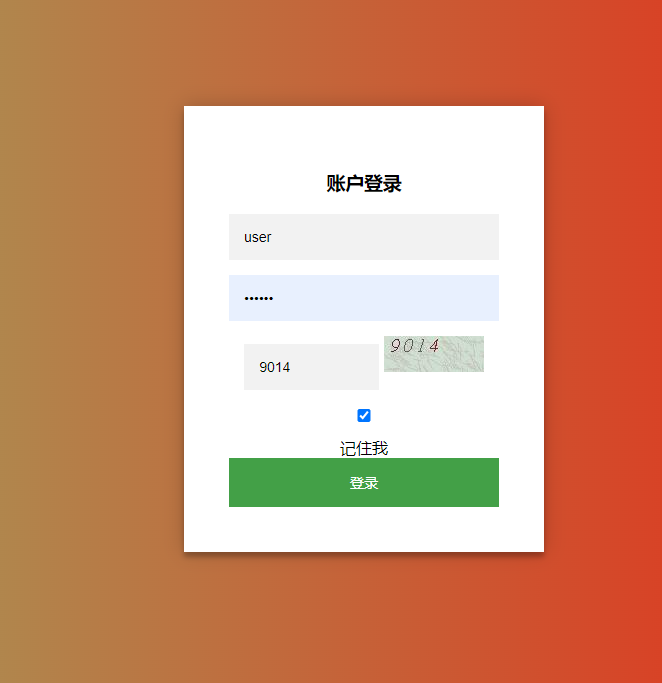 

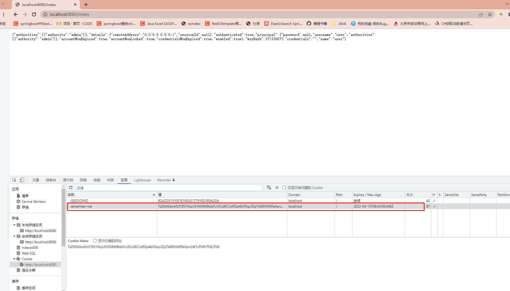

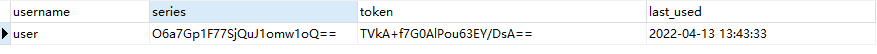

可以看到token信息已经成功持久化了，并且浏览器也成功生成了相应的cookie。在cookie未失效之前，无论是重开浏览器或者重启项目，用户都无需再次登录就可以访问系统资源了。